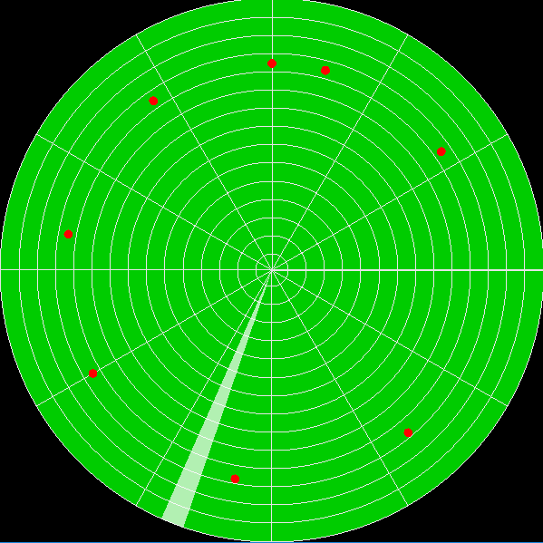

# radar-indicator
  
Simulation of a radar indicator using OpenGL (Freeglut library).  

Several targets move with given speed toward radar location. Target's position is updated when the radar beam passed the target.  

**Visual Studio setup:**  
1. Create a new project (Windows Console Application)
2. Add `main.cpp` and `radar.h` files
3. Add include directory to `freeglut/include`
4. Add path to `freeglut/lib` for x32 or `freeglut/lib/x64` for x64
5. Place `freeglut.dll` at the build folder
